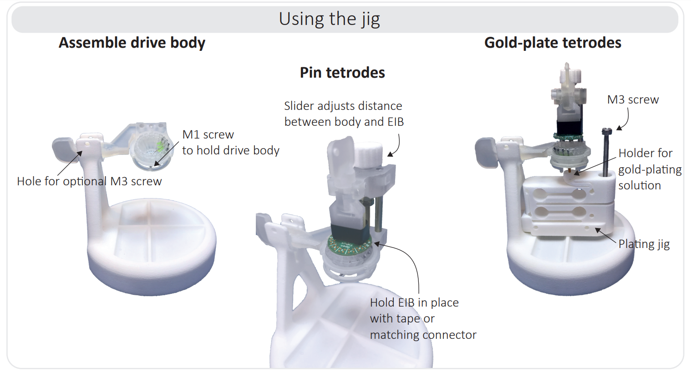

.. _refassemblyjig:

*************************************************
Assembly Jig
*************************************************

.. raw:: html

  <a href="https://open-ephys.org/drive-implant/drive-assembly-jig>"class="btn btn-primary" style="background-color:#f4d050;border-color:#f4d050">Buy Assembly Jig</a> 

The assembly jig was designed to hold the shuttleDrive as you assemble the drive, and pin and gold-plate electrodes.

.. image:: ../_static/images/assjig_make.png
  :align: center

