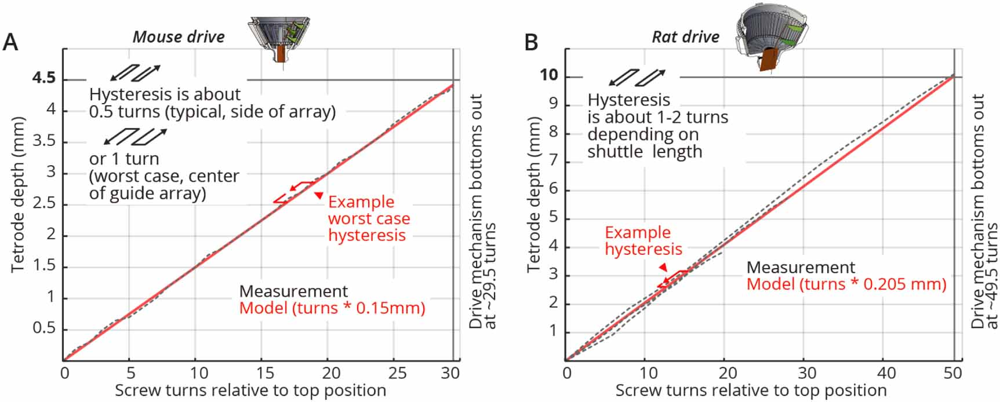

.. _depthtracking:

*************************************************
Electrode depth tracking
*************************************************

Electrodes in the shuttleDrive are lowered individually by turning the corresponding screw. To know where your electrodes end up, we need to know how far a tetrode is lowered with each full turn. This 'travel range' distance is in practice a combination of the mechanical properties of the drive, the mechanical/biological properties of the brain, and the way you choose to lower your electrodes.

ShuttleDrive Properties
##################################################

The 16-tetrode mouse shuttleDrive has a screw pitch (the distance between adjacent threads on the screw) of 0.15 mm/turn, and the correspondence of screw pitch to travel range is almost completely linear, so for each turn you can expect your tetrode to lower by 0.15 mm (when the drive is in air, see below).

.. raw:: html

  
 Tetrode depth measurements. Measurements of tetrode depths over the entire adjustment ranges for the mouse (A) and rat (B) variants. This travel was measured only in the downward direction; some hysteresis will occur when reversing the drives. Hysteresis is measured as the amount of screw rotation after a direction reversal at which point the tetrode started moving again. Hysteresis is caused by different factors; see main text for a short discussion. See inserts for typical measured hysteresis. The mouse drive behaves almost completely linearly with a 1:1 correspondence of screw pitch (0.15 mm/turn) to travel range. The rat drive shows some scaling of the travel with a 0.205 mm/turn vs. the 0.2 mm pitch screw. This factor was measured for a tetrode at the periphery of a circular guide tube array, and other arrangements may result in slightly different factors. We recommend individual calibration if this level of dead-reckoning precision is desired. Reaching the design travel ranges of 4.5 mm and 10 mm requires starting at the absolute top position and moving until the shuttle touches the bottom position. Extra care is needed at these positions in order to not drive the shuttle into the end stops and strip the threads. 

The rat drive shows some scaling of the travel with a 0.205 mm/turn vs. the 0.2 mm pitch screw. Different guide tube arrangements may result in slightly different factors, so we recommend individual calibration if a very high level of precision is desired.

When the direction of travel is reversed, some hysteresis will occur. Hysteresis is measured as the amount of screw rotation after a direction reversal at which point the tetrode started moving again. See the above figure for measurements of the drive range and hysteresis of the presented drive design. In practice around 75 to 150 $\mu{\mathrm m }$ of hysteresis can be expected for the mouse drive.

Tetrodes in the Brain
##################################################
The above measurements are performed in air, to characterize the mechanical hysteresis of the drive mechanism itself. In the brain, another level of biological hysteresis and changes in recorded units are expected from the reaction of the tissue to tetrodes. See `Dhawale et al 2017 <https://iopscience.iop.org/article/10.1088/1741-2552/ab77f9#jneab77f9bib10>`_ for a discussion of the expected effects. The neuropil can react to tetrode implantation with a cascade of processes that include inflammatory processes with glial cell activation and eventual scar tissue formation. Even in the absence of overt immune responses, the neuropil is not static, and the position of neurons relative to tetrodes can be expected to drift over time.

Lowering electrodes
**************************************************
Electrodes can be lowered as soon as the animal has recovered from surgery and is nesting. Delaying the onset of the lowering for more than ~5 days post surgery increases the risk that dura and bone regrowth interferes with the electrodes. Putting the mouse in a head-post on a floating ball, or on a flat smooth surface avoids putting torque on the implant if the mouse tries to run/jump during initial adjustments.

It can be beneficial to lower only one or two tetrodes at a time to avoid bunching. Waiting >2 hrs between lowering sessions to allow the brain to settle is also not a bad idea. This goes more for initial insertions into the brain. Keep in mind that the brain will initially be swollen after surgery, and depending on the position of the guide tube array relative to the brains non-swollen position, tetrode depths will change as the swelling subsides.

Try to record data during these lowering sessions and actually look at it, in e.g. simpleclust (or whatever spike sorting method you like) to check if you get units - L1 MUA can look surprisingly like units unless you look closely and sorting is the best way to know for sure when any given tetrode is in rather than just on the brain.
