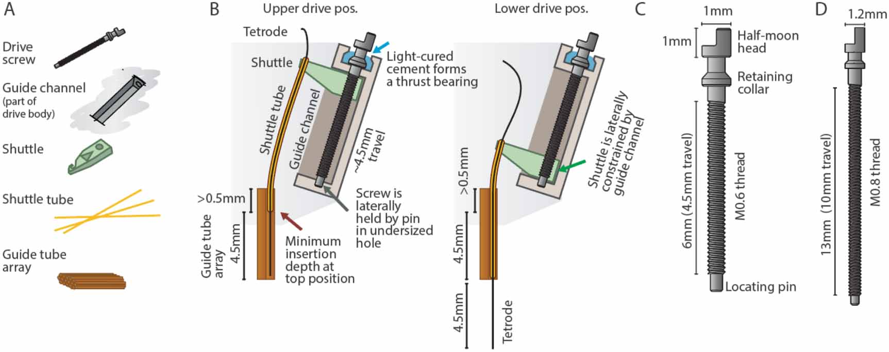

.. _drivemechanism:

*************************************************
Drive Mechanism
*************************************************

The drive mechanism is designed to allow tetrodes to move linearly when a screw is rotated. The shuttleDrive drive mechanism is formed by a moving shuttle that is pushed up and down by a rotating but otherwise retained screw. The shuttle itself cannot rotate along with the screw, because it is constrained by the guide channel that is part of the drive body.

The screw needs to be prevented from being pushed up and down by the friction of the shuttle and/or the force exerted by the adjustment screwdriver. Here, a custom screw is used that includes a retaining collar under the screw head that is glued into a recess, providing a rudimentary thrust-bearing with a high degree of stability. In addition, the bottom of the screw is retained laterally in a press-fit hole in the drive body.

  Custom screw design and drive mechanism (click to enlarge).

.. raw:: html

  
 A, Key components that make up one of the linear adjustment ('drive') mechanisms.   B, Overview of the internal drive mechanism—linearly moving shuttles (green) are actuated by captive screws. The screws move inside guide channels and are held at the bottom via their locating pins, and are held vertically at the top by gluing their retaining collars into concave pockets in the drive body. A straight guide tube array (orange) holds fused silica (Polymicro) shuttle tubes. At the topmost drive position, the shuttle tubes stay inserted in the guide tube array—this amount of insertion, plus the desired travel range, dictates the height of the guide tube array. The present design achieves ∼4.5 mm of travel.  C, Custom screw for the mouse drive. The central novel features are the retaining collar under the screw head, which acts as a thrust bearing, stopping the screw from moving up, but allowing rotation, and the locating pin at the bottom, which allows the screw to rotate but not move laterally.  D, Screw variant for use in the 64 drive design for rats and similarly sized animals. ∼10 mm of travel can be achieved.

The sizing of the drive components are chosen to be as small and closely spaced as possible. M0.6 screws are the smallest screw that is sufficiently robust in the required lengths. In both the mouse and the rat design, the position of the drive mechanisms are governed by spacing constraints that derive from the screw dimensions: the radial distance of the drives from the drive center is determined by the N of drive mechanisms (16 and 64), the width of the shuttle (determined by the drive screw size), and the need to maintain some wall thickness between guide channels. Additionally, the drive mechanisms are angled outwards by $32^{\circ}$ in order to provide an opening for loading shuttle tubes into the guide tube array when the drives are in a raised position, and in order to provide enough area at the top of the drive to attach the electrode interface board (EIB) and amplifier board. At the bottom position, the shuttles are almost touching each other.
