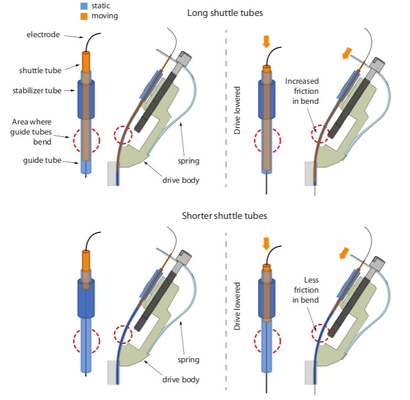

*************************************************
4- Assembling the drive body
*************************************************

.. raw:: html

    <body class="theme-default aui-theme-default">
        

            

                  

                    

                    Created by  Jakob Voigts, last modified on Jan 08, 2016
                    

                    

                    
  <em>(The picture shows the shuttle tube extending almost all the way through the guide tube - this can increase the friction of the drive and cause problems. It is often better to keep the shuttle tubes as short as possible, so they stop short of the bend in the guide tube when the drive is fully lowered.)</em> 

                    <h3 id="id-4-Assemblingthedrivebody-Drivebodyassembly">Drive body assembly </h3>

                    In this step, the electrode guide tube array and the spring are attached to the drive body.  
                    Next, individual guide tubes and arms of the spring are assembled into the drive mechanisms.

                    
Clean printed drive body: check for extra plastic on the inside fins and guides

                    
Depending on the quality of the 3d-print, finish the screw holes with #77 drill. Be careful to drill out the holes at the correct angle - with lower quality prints it is pretty easy to break through the inner wall of the drive body rim. Fitting a #77 drill bit into an ordinary electric drill might be a challenge. A keyless chuck (MCM Part #: 22-16500, Dremel Part #: 4486) can fit on a Dremel rotary tool, and holds even the finest drill bits.  Alternatively, the drill bit can be hold with a mini pin vise (MSC direct), than in turn will fit into an electric drill. It is worthwhile to test which drilling speed works best for each user - in some cases a higher speed tool such as a dremel can significantly simplify the drilling.

                    
 

                    
The slots along the inside perimter of the drive body may have to be finished with a #77 drill or razor blade if the print quality is low–they must be large enough to allow the 33ga polyimide tubing through.

                    
 

                    
Clean off plastic dust with compressed air, water, or ethanol, be careful when using ethanol as it will weaken the plastic when exposed for too long.

Make sure all plastic dust is cleared form the holes after drilling by inserting a clean drill bit and checking if it comes out clean of plastic dust.

Carefully ‘tap’ screw holes by screwing a drive screw all the way in, and removing it from each hole. To speed up this step, solder a screw to a piece of metal to use as handle. (If you're using titanium screws, flattening the head a bit with a dremel and crimping the screw into a handle is probably easier than trying to attach it with solder.) Now clean the hole again with compressed air/water. <strong>If there is plastic dust left in the holes, it can seem like the screws fit well judging by the torque required to turn them, but they might not 'bite' the plastic correctly and might not properly lower or rise. </strong><strong style="line-height: 1.4285715;">Pay close attention to how much torque is required for turning the screws</strong>  - if you feel any significant resistance now there is a good chance the screws will break later on in the drive-building process. In most cases too much torque means that there is too much plastic dust left in the holes, and you may have to drill them out more. If a screw breaks, you can sometimes carefully remove it with pliers.

                      <em>(picture shows older version of the spring)</em>  

Align the spring with the sides of the drive body (the small protrusions on the drive body should fit into the cutouts on the solder tabs of the spring). Glue the spring to the drive body using epoxy both at the sides and around the bottom of the drive at the radial slot cutouts in the spring. Make sure the bottom and sides are making full contact to the drive body and let epoxy cure fully before bending the spring arms. Placing the spring arms under screws while the epoxy still has even minimal creep can detach the spring.

                     

Glue guide tube assembly into drive bottom with epoxy, make sure the guide tubes are aligned. For most applications the tubes should be parallel to the main axis of the drive, but deviations of up to 15deg. are possible if desired. Use only a small amount of epoxy, and make sure none drips too far into the drive body so that the guide tubes can fan out immediately once inside the drive body or else you will have a lot of trouble getting them into the perimeter slots without kinking the tubes.

Cut the guide tube assembly about 5mm from the drive bottom using a fresh razor blade. The length of the protruding guide tubes can be chosen to fit the experimental design: Longer lengths increase visibility during the implant surgery and are useful in order to leave space for head posts etc., but shorter lengths lower the center of gravity on the head. If longer lengths are desired, make sure that a coat of epoxy extends all the way to the bottom, keeping the guide tubes in alignment.

 For lateral targets, it might make sense to cut the guide tube array at an angle corresponding to the angle of the skull at the site.

 

                    
Inspect the bottom of the guide tube array and check for any defects. Also document the position of the guide tubes so that the electrode positions can be reconstructed with better precision later on.
                    

 

                    
Move guide tubes into the row of slots at the insider perimeter of the drive body. Make sure to keep the tubes as straight as possible, you may need to redistribute the tubes before you glue them into their final placement. Hold guide tubes in place by sliding very short pieces of 26ga polyimide tube (also called 'stabilizer tube') down from the end of the guide tube and pressing them into the larger, upper slots of the drive body (the thicker stabilizer tube should rest on top of the smaller, lower slots).

Glue guide tubes into place with thin layer of epoxy. It's okay if you get epoxy in between the guide tube and stabilizer tube.

 <em>(The picture shows the shuttle tube extending almost all the way through the guide tube - this can increase the friction of the drive and cause problems. It is often better to keep the shuttle tubes as short as possible, so they stop short of the bend in the guide tube when the drive is fully lowered.)  </em>

(optional) Map out the relationship between guide tubes at the drive bottom and the recently-glued guide tubes at the top of the drive by inserting a thin wire or spare tetrode into the guide tubes one at a time.

Cut the guide tubes so that they extend about 1 mm above where they are epoxied to the stabilizer tubes. Screw in the screws about half way, and bend and slide the spring arms under the screw heads.

Cut 16 pieces of 37 or 38 ga polyimide tubing to ~2cm to make the shuttle tubes.

                    
  Insert shuttle tubes into guide tubes so that they are inserted ~1mm at the most retracted position. This minimizes the length of  the shuttle tubes that is inside the guide tubes - if that length is too long, it increases friction. <strong>Keep in mind the spring arms are halfway through their range of motion so make sure to account for how much further the screws could be retracted.</strong> <strong>If the shuttle tubes are so long as to reach the 'bend' at the bottom of the guide tubes, this can cause problems if the sizing of the tubes is tight - avoid this if possible. If the shuttle tubes are too short they can be accidentally removed from the ends of the guide tubes later on. </strong>See the image below for a schematic of how this shorter shuttle tube can reduce the friction: 

.. raw:: html
                    
<strong> </strong>

Next, glue shuttle tube to spring arm; it is often easiest to do this in one of the corners of the spring arm but any stable location on the spring should work okay. If the shuttle tube doesn't naturally rest against the spring arm, attach it with a tiny bit of super glue before applying epoxy. Superglue alone will not hold the tube to the spring arm! Apply a generous amount of epoxy while avoiding the inside of the tubes and the screw, you can use two layers of epoxy for added stability.

Cut the shuttle tubes tubes a few mm upwards from where they meet the springs.

<em>If no optical fiber is used, the drive is now ready for attaching the EIB and electrode loading. </em>  
<h3 id="id-4-Assemblingthedrivebody-Opticalfibers">Optical fibers</h3>
Cleave optical fiber to desired length, attach to ferrule and polish both ends.

(optional) cut a groove into the ferrule using a high-speed cutting wheel to improve adhesion of epoxy.

(or - if using fiber stubs with prepared ferrules), cut to length and polish bottom end.

Insert optical fibers into openings in the guide tube array, don’t glue them yet. The fibers are only held by attaching them to the EIB.

<em>The drive is now ready for attaching the EIB and electrode loading.</em>

                    

                    

                        

                            <h2 id="attachments" class="pageSectionTitle">Attachments:</h2>
                        

                    

                

              

          

        </body>
